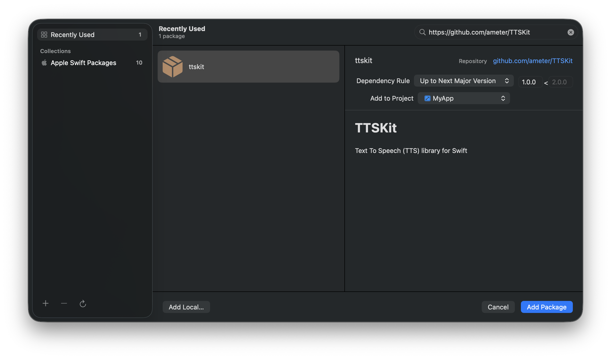
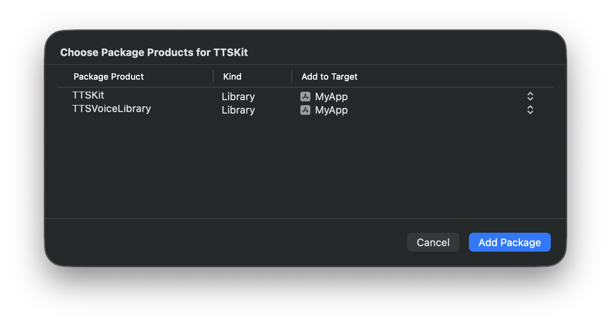
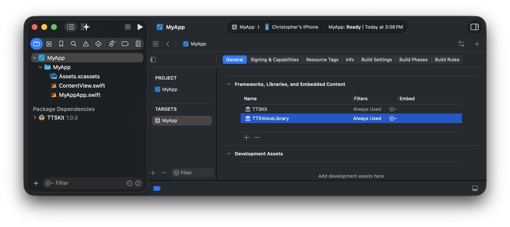

# TTSKit
Text To Speech (TTS) library for Swift

## Overview

TTSKit was developed to solve the problem of intelligibility when synthesizing text. This is often an issue when generating short, single-word utterances without additional context. For example, spelling word drills and other similar use cases are especially troublesome. While the built-in AVFoundation utilities are useful for longer texts with more contextual support, TTSKit focuses on intelligibility over naturalness. TTSKit is based on [CMU Flite](https://github.com/festvox/flite), which is used for synthesis.

## Installation

TTSKit is available as an SPM package.

1. Add TTSKit to your Xcode project by selecting **File, Add Package Dependencies...** and entering the TTSKit GitHub repository URL: ```https://github.com/ameter/TTSKit``` in the search search box.



2. Select the **Dependency Rule** you want to use.  **Up to Next Major Version** is a good choice to allow non-breaking updates for dependencies that use [semantic versioning](https://semver.org).

3. Click **Add Package**.  Xcode will display the the products.  TTSKit ships with 2 products:
- TTSKit - the core library.
- TTSVoiceLibrary - a collection of optional voices.

4. Select the your **app's target** for each product you want to add.  For prototyping and development, go ahead and add both products to your app's target.  For additional information on voices, including best practices for production apps, see the [Voices](#voices) section of this readme.



5. Click **Add Package**

## Usage

### Basic Usage

```swift
include TTSKit
...
let tts = TTSKit()
try? tts.speak(text: "Hello, World!")
```

### Playback Controls

TODO: add documentation for speak queued, stop, pause, and resume

### Demo App

See the [Demo App](Examples/TTSKitDemo/TTSKitDemo.xcodeproj) for additional usage examples.  It also provides a quick way to get started with TTSKit and to experiment with different voices.

## Voices

TTSKit ships with builtin male and female voices.  Addional voices are available in the optional `TTSVoiceLibrary` product.  You can also load your own voices.  All **flitevox** compatible voices are supported.  If you do not load a specific voice, the default female voice will be used.

### Loading Voices

There are 3 different ways to load voices:

#### Builtin Voices:
```swift
import TTSKit
...
let tts = TTSKit()
tts.loadVoice(.male)
```

#### TTSVoiceLibrary Voices:
```swift
import TTSKit
import TTSVoiceLibrary
...
let tts = TTSKit()
try? tts.loadVoice(fromLibrary: .cmuUsRms)
```

#### Other Voices:
```swift
import TTSKit
...
let tts = TTSKit()
if let voiceURL = Bundle.main.url(forResource: "cmu_us_rms", withExtension: "flitevox") {
    try? tts.loadVoice(at: voiceURL)
}
```

### Bundle Size Optimization

For production apps, you should only include the full **TTSVoiceLibrary** if you specificaly want to include **all** available voices.  Otherwise, you can decrease your app's bundle size by not including **TTSVoiceLibrary** in your app's target.  If you previously added it, you can remove it by navigating to your **App's Target**, **General**, **Frameworks, Libraries, and Embedded Content**, selecting **TTSVoiceLibrary**, and clicking the **Minus**.



You can import individual voices by copying the **.flitevox** files into your app and then loading them via the URL.

## Voice Customization

TTSKit includes several settings which can be used to customize speech synthesis.  There are availabe via the settings API.  For example, you can increase the speech rate as follows:
```swift
include TTSKit
...
let tts = TTSKit()
tts.settings.rate
```

TODO: add documentation for all settings

## Contributing

I ❤️ community contributions.  An effective workflow for library development is to create a workspace (e.g. TTSKit.workspace) **outside** the TTSKit repo folder and then add both the [Demo App](Examples/TTSKitDemo/TTSKitDemo.xcodeproj) and the [TTSKit folder](.) to the workspace.  Please submit [pull requests](https://github.com/ameter/TTSKit/pulls) for any changes you would like to see included in the library. 

